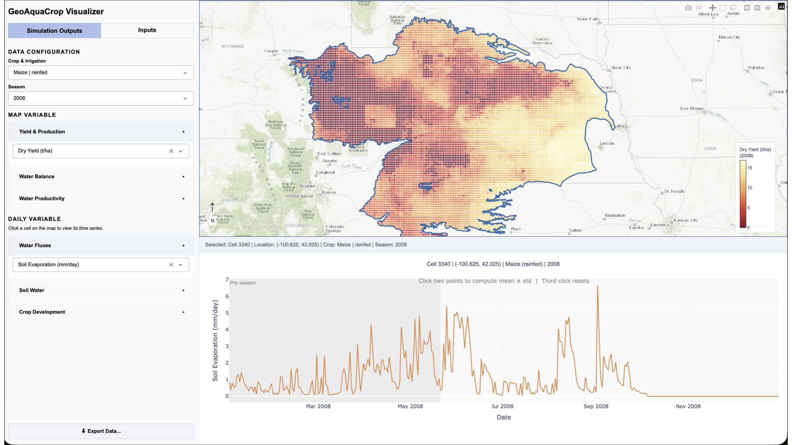

# GeoAquaCrop Visualize

An interactive Dash/Plotly application for exploring **gridded AquaCrop
simulations**. Point it at a completed model run and it gives you a map of the
region, a variable picker, and a click-through to per-cell daily time series —
plus the inputs those runs were driven by, and a gridded export of anything you
select.

## Screenshot



- [Requirements](#requirements)
- [Installation](#installation)
- [Connecting your data](#connecting-your-data)
- [Running the app](#running-the-app)
- [Using the app](#using-the-app)
- [Exporting data](#exporting-data)
- [Configuration](#configuration)
- [Project structure](#project-structure)
- [Running the tests](#running-the-tests)
- [Documentation](#documentation)
- [Troubleshooting](#troubleshooting)

---

## What you get

| | |
|---|---|
| **Choropleth maps** | 11 seasonal output variables — yield, production, irrigation, ET, water productivity — over the simulation grid, on an ESRI topographic basemap with the region outline traced on top. |
| **Daily time series** | 13 daily variables (water fluxes, soil water, crop development) for any cell, read straight from the simulation's daily tables. |
| **Model inputs** | The climate forcing (4 variables), the crop calendar, and SPAM physical crop areas, on the same grid as the outputs. |
| **Spatial selection** | Click a cell for its time series; lasso or box-select many cells to highlight them and scope an export to just that area. |
| **Season handling** | One season at a time, or *All years* aggregated by mean or sum — each variable carries a sensible default. |
| **Gridded export** | Any set of cells, variables, and dates to NetCDF, GeoTIFF, or CSV. |

Everything loads once at startup, so interaction is instant afterwards.

---

## Requirements

- **Python 3.10 or newer**
- **A completed AquaCrop run.** The app is a viewer, not a model — it reads the
  outputs of `geoaquacrop-simulate` and the preprocessed inputs from
  `geoaquacrop-preproc`. See [Connecting your data](#connecting-your-data).

Runtime dependencies (`pandas`, `numpy`, `xarray`, `netCDF4`, `scipy`,
`plotly`, `dash`, `dash-bootstrap-components`) install automatically. Note that
the maps use the MapLibre trace API, which needs **Plotly 6 or newer**.

---

## Installation

```bash
pip install -e ".[geotiff]"
```

Editable (`-e`) is recommended: `config.py` locates your data by searching
upward from its own location, which works most naturally from a checkout.

| Extra | Adds | For |
|---|---|---|
| `geotiff` | `rasterio` | GeoTIFF export. Without it, that one format is skipped and the other two still work. |
| `test` | `pytest` | The test suite. |
| `docs` | `Sphinx`, `sphinx-rtd-theme` | Rebuilding the HTML docs. |
| `dev` | all of the above | Contributing. |

Dependencies are declared without version constraints, so pip resolves whatever
is current. If you need a reproducible environment, capture one with
`pip freeze > requirements.txt` after a working install.

---

## Connecting your data

The app expects three sibling directories under one workspace folder:

```
<workspace>/
├── geoaquacrop_preprocess/            # preprocessed model inputs
│   ├── inputdata/
│   │   └── region_boundary.geojson     # region outline
│   └── processed/
│       ├── MaxTemp*.nc  MinTemp*.nc  Precipitation*.nc  ReferenceET*.nc
│       ├── cropcalendar.nc
│       └── spam*_physical_area.nc
├── geoaquacrop_simulate/
│   └── outputs/
│       ├── summary_results_<timestamp>.pkl    # seasonal results per cell
│       └── daily_results_<timestamp>.pkl      # daily tables per cell
└── geoaquacrop_visualize/         # ← this project
```

**Finding the workspace.** At import, `config.py` walks up from its own location
and then from your working directory, looking for a folder that contains
`geoaquacrop-preproc`. That covers a source checkout, an editable install, and a
plain `pip install .`.

**Overriding it.** Set the environment variable — this is the reliable way, and
the one to use if your trees live somewhere else:

```bash
export GEOAQUACROP_ROOT=/path/to/workspace
```

**Pointing at a different run.** The two pickle filenames carry a run timestamp
and are set explicitly in [`config.py`](src/geoaquacrop_plotting/config.py) as
`SUMMARY_PKL` and `DAILY_PKL`. Edit those to switch runs.

> No data is bundled with this repository, and none needs to be copied into it.
> The region outline, for instance, is read from `GEOJSON_PATH` and thinned in
> memory at startup — see [`boundary.py`](src/geoaquacrop_plotting/boundary.py).

---

## Running the app

```bash
geoaquacrop_visualize            # console script, installed with the package
```

Then open **<http://localhost:8050>**.

Startup loads every dataset, pre-computes the aggregations, and prints a couple
of diagnostic lines (the auto-derived map zoom, and the region boundary
statistics). Expect a few seconds, depending on the size of your run.

---

## Using the app

The window is a control sidebar on the left and a map canvas on the right. Two
tabs at the top of the sidebar switch what you are looking at.

### Simulation Outputs tab

1. **Choose a crop and irrigation type**, then a **season** — a single harvest
   year, or *All years*.
2. When *All years* is selected, an **Aggregation** toggle appears: *Mean* or
   *Sum*. Each variable has a sensible default (yields average, irrigation and
   production sum).
3. **Pick a map variable** from the accordion, grouped as *Yield & Production*,
   *Water Balance*, and *Water Productivity*. The map recolours immediately.
4. **Click any cell** to open its daily time series below the map. Choose the
   daily variable from the *Water Fluxes*, *Soil Water*, and *Crop Development*
   groups.
5. **Click two points on the time series** to mark a window: the app shades it,
   draws the mean as a dashed line, and reports the mean ± standard deviation
   over that period. A third click clears it.
6. **Lasso or box-select** a group of cells (the tools are in the Plotly toolbar
   at the top-right of the map) to highlight them in orange. The count appears
   in the ribbon above the map, and the export dialog can then be scoped to just
   that selection.

### Inputs tab

Shows the data that drove the simulation, on the same grid: the climate variable
of your choice (max/min temperature, precipitation, reference ET), the crop
calendar for the selected cell, and SPAM physical crop areas for the selected
crop. Clicking a cell here opens the climate time series for that cell.

### Map controls

Pan and zoom are preserved as you change variables, so you can stay zoomed into
one area while cycling through the outputs. Hovering a cell shows its
coordinates and the current variable's value.

---

## Exporting data

**⬇ Export Data…** at the bottom of the sidebar opens a dialog with four choices:

| Choice | Options |
|---|---|
| **Variables** | Any of the 13 daily variables, grouped as in the sidebar. |
| **Period** | The whole simulation, or an explicit start and end date. |
| **Cells** | The whole area, or just your current map selection. |
| **Format** | NetCDF (`.nc`), GeoTIFF (`.tif`), CSV (`.csv`) — any combination. |

Output is assembled as a time × y × x grid per variable and written to
`outputs/exports/` beside the project (or to your working directory when the
package is installed into `site-packages`). The dialog reports the filenames it
wrote.

GeoTIFF needs `rasterio`. If it is missing, that format is skipped with a note
in the status message and the others are still written.

---

## Configuration

All user-facing settings live in
[`src/geoaquacrop_plotting/config.py`](src/geoaquacrop_plotting/config.py).

| Setting | Default | What it does |
|---|---|---|
| `SUMMARY_PKL`, `DAILY_PKL` | run-timestamped | Which simulation run to display. |
| `GEOJSON_PATH` | `geoaquacrop-preproc/inputdata/high_plains.geojson` | The region outline. |
| `PROCESSED_DIR` | `geoaquacrop-preproc/processed` | Climate, crop calendar, and SPAM grids. |
| `EXPORT_DIR` | `outputs/exports` | Where exports are written. |
| `CELL_RES` | `0.05` | Grid cell size in degrees. Must match the preprocessing grid. |
| `PORT` | `8050` | Port the app serves on. |
| `MAP_HEIGHT`, `TS_HEIGHT` | `550`, `400` | Canvas heights in pixels. |
| `BOUNDARY_SIMPLIFY_EPS` | `0.004` | Outline simplification tolerance in degrees (~400 m). Raise for a lighter outline, lower for a crisper one. |
| `MAP_VARIABLES` | 11 entries | Map variable catalogue: label, colourscale, default aggregation. |
| `DAILY_VARIABLES` | 13 entries | Daily variable catalogue: label, source table, line colour. |
| `CLIMATE_VARIABLES` | 4 entries | Climate variable catalogue. |

Adding a variable is a matter of adding an entry to the relevant catalogue — the
sidebar, the maps, and the export dialog all read from these dictionaries.

---

## Project structure

```
geoaquacrop_visualize/
├── pyproject.toml                  # Packaging + pytest configuration
├── src/                            # Everything importable
│   ├── geoaquacrop_plots.py        # Entry point (`main()` / console script)
│   └── geoaquacrop_plotting/       # Application package, 22 modules
│       ├── config.py               #   ← paths, sizes, variable catalogues
│       ├── utils.py  data.py  grid.py  aggregates.py  queries.py
│       ├── boundary.py             #   ← region outline, thinned and served by URL
│       ├── export.py  figures_maps.py  figures_timeseries.py
│       ├── styles.py  app_shell.py
│       ├── layout*.py              #   ← sidebar, panels, export modal, assembly
│       └── callbacks_*.py          #   ← controls, selection, maps, ts, export
├── tests/                          # Everything test-only
│   ├── _paths.py                   # Finds the package (flat or src layout)
│   ├── conftest.py                 # Fixtures + data-free import setup
│   └── test_*.py                   # One module per application module
└── docs/                           # Built HTML documentation
```

The package is split by concern, and the split is enforced: the test suite
checks that no module exceeds 500 lines, that the import graph stays acyclic,
that callbacks never import each other, and that only `data.py` opens the
pickles — so the datasets can only ever be loaded once.

**Why `src/`?** Nothing is importable from the working directory.
`import geoaquacrop_plotting` resolves only once the project is installed (or via
the `pythonpath = ["src"]` setting `pyproject.toml` gives pytest), so the tests
can never accidentally pass against a stray copy sitting in the checkout — they
exercise the code the way you would receive it.

---

## Running the tests

```bash
pytest                            # 523 tests, ~1 s
pytest tests/test_utils.py -v     # a single module
pytest -k colorscale              # by keyword
```

**No data files are required.** `tests/conftest.py` points `GEOAQUACROP_ROOT` at
an empty stub directory and registers a stub parent package, so `config`,
`utils`, `styles`, and `app_shell` are imported and tested for real, while the
data-loading modules are covered by mirroring their logic against synthetic
fixtures.

---

## Documentation

`docs/` holds the built HTML documentation — open `docs/index.html` in a browser.
It covers the architecture, the module API, and the configuration reference in
more depth than this README.

The reStructuredText sources live in the parent project's `docs_src/`. Edit them
there and rebuild:

```bash
sphinx-build -b html docs_src docs      # from the parent project root
```

---

## Troubleshooting

**`FileNotFoundError: Could not find the GeoAquaCrop data trees`**
`config.py` could not locate a folder containing `geoaquacrop-preproc`. The
message reports every path it searched. Set `GEOAQUACROP_ROOT` to the folder
holding your `geoaquacrop-preproc` and `geoaquacrop-simulate` trees.

**The app starts but a pickle fails to load**
`SUMMARY_PKL` and `DAILY_PKL` name a specific run timestamp. Check that the
filenames in `config.py` match the files actually in
`geoaquacrop-simulate/outputs/`.

**No region outline on the map**
The outline is served from `/region-boundary.geojson`, derived at startup from
`GEOJSON_PATH`. Startup prints a `Region boundary: …` line reporting how many
polygons and vertices it produced — if that line is missing or reports zero, the
source GeoJSON is the place to look.

**`(rasterio not installed — GeoTIFF skipped)` in the export status**
Install the optional extra: `pip install -e ".[geotiff]"`.

**The map is blank but the sidebar works**
The basemap tiles come from ESRI's public tile server, so the app needs network
access to draw them. The data layers render regardless.
